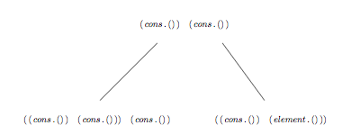
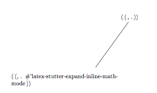

# Stutter-mode

Stutter mode is heavily inspired by [vhdl-mode's stutter-mode](https://guest.iis.ee.ethz.ch/~zimmi/emacs/vhdl-mode.html), but seeks to both generalise it's usage to whatever mode you'd like, and also make the implementation sleeker. The implementation is two-fold

## Stutter-tree
Stutter-tree is a tree that holds a cons-cell structure like so:



every node in the tree is a list of cons-cells like this

( (cons-element . m-list) (cons-element . m-list) (cons-element . m-list) )

which we dub a m-list.

where each cons-element is one of two things:

+ 1. A cons cell

+ 2. An id
The id is whatever the tree cons shall contain. Usually a char.

The cdr is also one of two things

+ 1. A function to be executed
Simple an interactive function that is run if a stutter is to be executed.

+ 2. m-list
Structure described above.

## Case study - LaTeX-stutter-mode

### Create a stutter

A stutter is created using the function
``` emacs-lisp
(insert-and-create-stutter stutter function stutter-tree-root-pointer)
```
For now we have grown tired of typing the inline math-mode "\( \)", which frankly is quite awkard to type. Therefore we create a function to insert the required text, and add it to ",,", which is a key-combination very rarely used - especially in LaTeX. Thus

``` emacs-lisp
  (insert-and-create-stutter ",," #'latex-stutter-expand-inline-math-mode latex-stutter-character-expansion-tree)
```

Creates and inserts the stutter into the stutter-tree "latex-stutter-character-expansion-tree".

Which now makes the stutter-tree look like:



### The expansion of this stutter, and a few more will now look like

